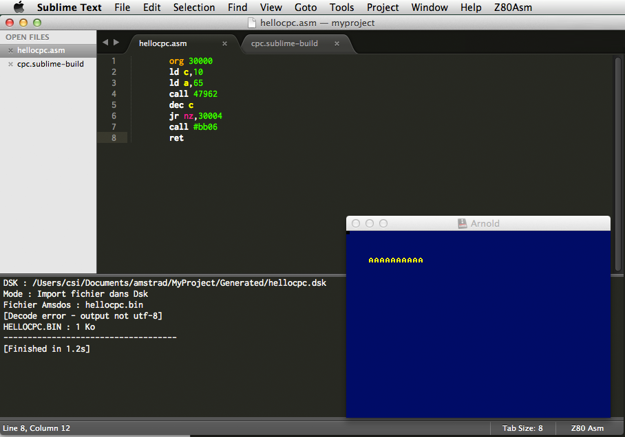

CPC Mac ASM
===========

Tools to compile Amstrad CPC ASM on Mac OS X

# Description
---

This set of tools contains Pasmo (Z80 compiler), iDSK (dsk manager), Sublime Text build command and AppleScript to run dsk in [Arnold](http://www.bannister.org/software/arnold.htm) emulator.

# Screenshot
---

# Authors
---

Pasmo © 2004-2006 Julián Albo.
Use and distribution allowed under the terms of the GPL license.

iDSK - Sid from IMPACT / PulkoMandy from the Shinra Team 

